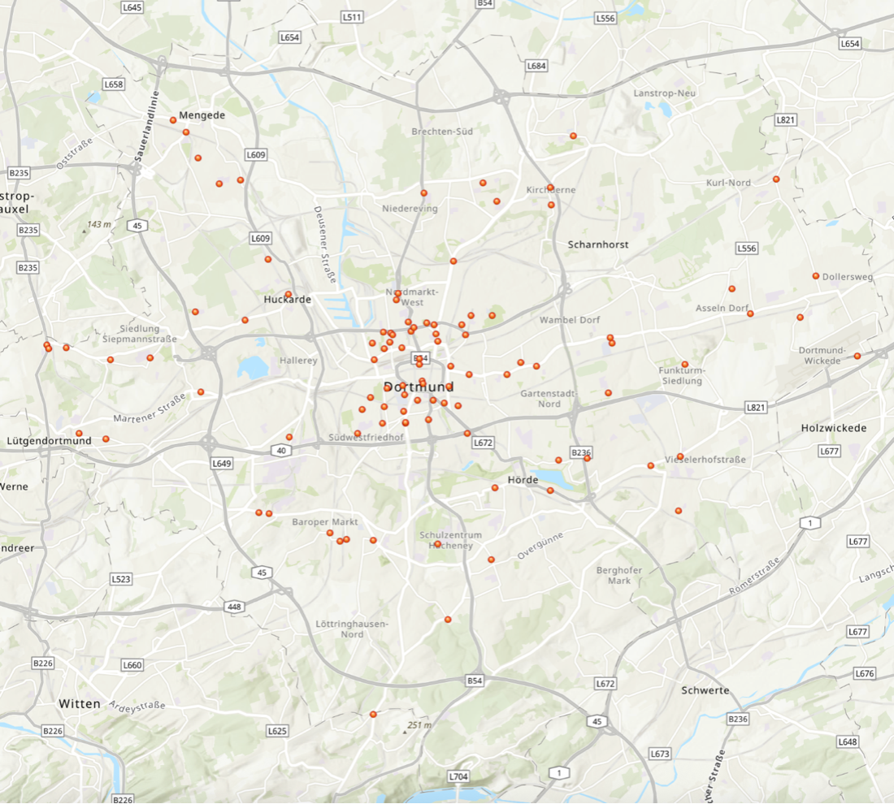
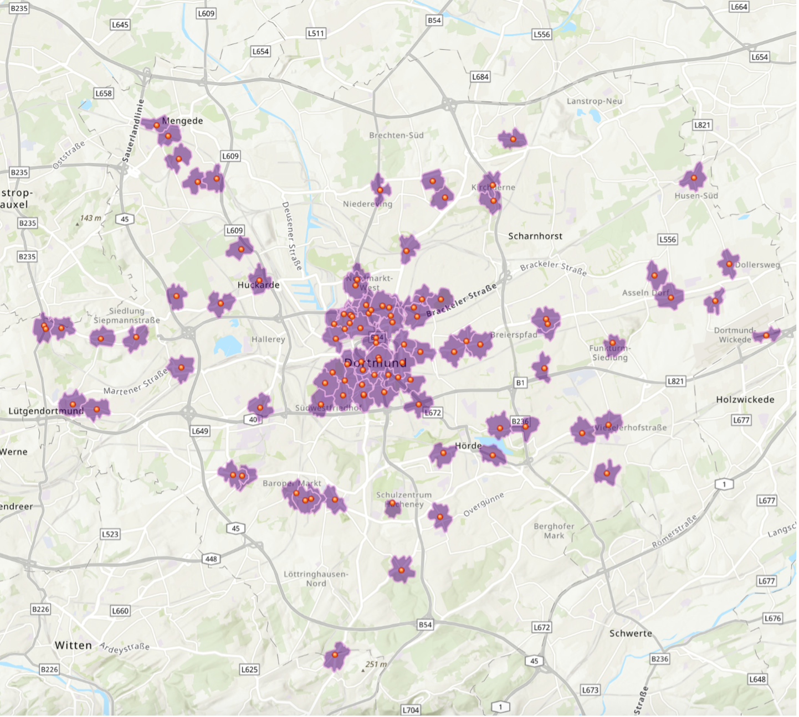

  
  
  
  

# Synthetische Stimmbezirke

Dieses Repository enthält die **Daten und Beispielmaterialien** zum Blogpost

**„Synthetische Stimmbezirke zur Verbesserung der räumlichen Präzision wahlstatistischer Analysen“**  
Nick Schlitter & Manuel Diaz Garcia

Ziel des Projekts ist es, zu demonstrieren, wie mithilfe synthetischer Stimmbezirke kleinräumigere und lebensweltlich plausiblere Analyseebenen für wahlstatistische Forschung erzeugt werden können. Der Ansatz überbrückt die Lücke zwischen grob aggregierten amtlichen Wahldaten und individualbasierten Umfragedaten.

---

## Inhalt des Repositories

- **`do_stimmbezirke_2020/`**  
  Amtliche Stimmbezirksdaten (Dortmund, Kommunalwahl NRW 2020)

- **`do_stimmbezirke_2025/`**  
  Amtliche Stimmbezirksdaten (Dortmund, Kommunalwahl NRW 2025)

- **`synth_stimmbez/`**  
  Beispielhafte synthetische Stimmbezirke (Catchment Areas um Kioske)

- **`do_kiosk_sample.csv`**  
  Beispieldatensatz mit Kioskstandorten als alltagsnahe räumliche Ankerpunkte

---

## Verwendung

Die Daten dienen der **Replikation und Illustration** des im Blogpost beschriebenen Workflows:

1. Erstellung von Catchment Areas um lokale Ankerpunkte  
2. Räumliche Überlagerung mit amtlichen Stimmbezirken  
3. Flächengewichtete Aggregation wahlstatistischer Kennzahlen  

Die Umsetzung wird im Blogpost exemplarisch mit **ArcGIS** erläutert, ist jedoch ebenso mit **R**, **QGIS** oder anderen GIS-Tools möglich.

---

## Hinweise

- Synthetische Stimmbezirke sind **keine amtlichen Verwaltungseinheiten**, sondern analytische Konstrukte.
- Die bereitgestellten Daten dienen primär **Forschungs- und Demonstrationszwecken**.

---

## Referenz

Falls Sie die Daten oder das Konzept zitieren möchten, verweisen Sie bitte auf den zugehörigen Blogpost:

> Schlitter, N. & Diaz Garcia, M.  
> *Synthetische Stimmbezirke zur Verbesserung der räumlichen Präzision wahlstatistischer Analysen*
